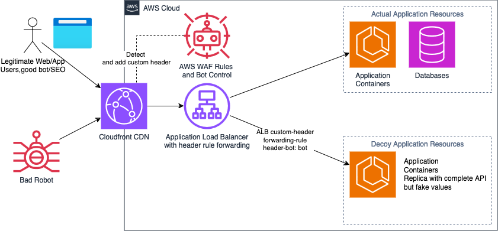

# Honeypot Blog Deployment

This repository houses the application source code along with infrastructure-as-code (IaC) configurations for build and deployment processes. It enables the deployment of a honeypot blog utilizing Terraform and CloudFormation across multiple cloud environments.

## Deployment Options

This project supports multiple deployment options:

1. **AWS ECS with Terraform**: Utilize the Terraform configurations in the `deployment/terraform/` directory for a more flexible and robust deployment.
2. **AWS ECS with CloudFormation**: Use the `deployment/honeypot-ecs-cloudformation.yaml` template to deploy the honeypot blog on Amazon ECS.

## Getting Started

1. Clone this repository:
   ```
   git clone https://github.com/your-username/honeypot-blog-deployment.git
   cd honeypot-blog-deployment
   ```

2. Choose your preferred deployment method:

   - For Terraform:
     ```
     cd deployment/terraform
     terraform init
     terraform plan
     terraform apply
     ```
    - For CloudFormation:
     ```
     aws cloudformation create-stack --stack-name honeypot-blog --template-body file://deployment/honeypot-ecs-cloudformation.yaml
     ```
## Configuration

- Modify the CloudFormation template or Terraform files as needed to customize your deployment.

## Architecture
with modifications, we can implement honeypot routing as below final architecture.

## Contributing

1. Fork the repository
2. Create your feature branch (`git checkout -b feature/AmazingFeature`)
3. Commit your changes (`git commit -m 'Add some AmazingFeature'`)
4. Push to the branch (`git push origin feature/AmazingFeature`)
5. Open a Pull Request

## License

This project is licensed under the MIT License - see the [LICENSE](LICENSE) file for details.

## Acknowledgments

- AWS CloudFormation and ECS documentation
- Terraform documentation

## Running the Application

To run the application locally:

1. Build and run the Docker container:
   ```
   docker-compose up --build
   ```

2. Access the application at `http://localhost:80`
